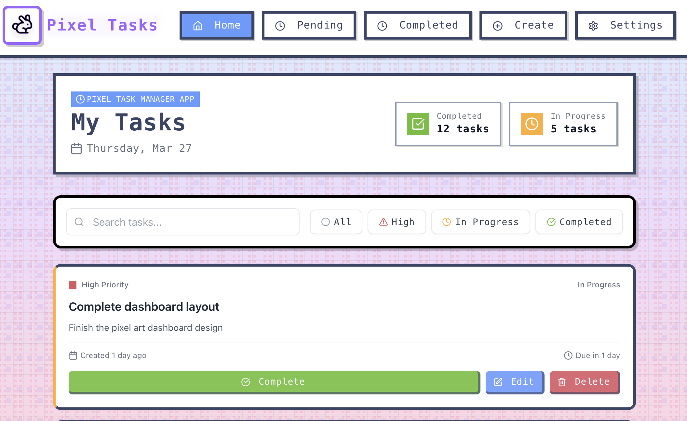

# Pixel Task Manager App

A demo application showcasing a modern, pixel-art inspired task management interface. This project serves as an example of how to combine retro aesthetics with contemporary functionality using React and TypeScript. It's perfect for learning and demonstration purposes, featuring a unique pixel art design and example task data.

> **Note**: This is a demo application that uses example data. All tasks are reset to default values on page refresh, and no data is persisted. It's designed to showcase the UI/UX and functionality rather than serve as a production-ready task management solution.



## 🌟 Features

### 🎨 Visual Design
- Pixel art inspired UI elements
- Retro-style animations and transitions
- Custom pixel font for authentic retro feel
- Responsive design that works on all devices
- Clean and minimalist interface

### 📝 Task Management
- **Create Tasks**
  - Add new tasks with title and description
  - Set priority levels (high, medium, low)
  - Assign due dates
  - Add detailed descriptions

- **Task Organization**
  - Multiple status options (todo, in-progress, completed)
  - Priority-based task sorting
  - Due date tracking
  - Creation timestamp

- **Task Actions**
  - Edit existing tasks
  - Delete tasks
  - Mark tasks as complete
  - Filter tasks by status and priority

### 🎯 User Experience
- Instant feedback with toast notifications
- Smooth animations for all interactions
- Intuitive task creation and management
- Default task state on refresh for quick start
- Real-time task status updates

## 🛠️ Tech Stack

- **Frontend Framework**: React 18
- **Language**: TypeScript
- **Styling**: 
  - Tailwind CSS
  - Custom pixel art styles
- **Build Tool**: Vite
- **State Management**: React Context API
- **UI Components**: Custom pixel-art components
- **Notifications**: Sonner
- **Icons**: Lucide React

## 🚀 Getting Started

### Prerequisites

- Node.js (v14 or higher)
- npm or yarn package manager
- Modern web browser

### Installation

1. Clone the repository:
```bash
git clone [your-repository-url]
cd pixel-task-manager
```

2. Install dependencies:
```bash
npm install
# or
yarn install
```

3. Start the development server:
```bash
npm run dev
# or
yarn dev
```

4. Open your browser and navigate to `http://localhost:5173`

## 📁 Project Structure

```
pixel-task-manager/
├── src/
│   ├── components/     # Reusable UI components
│   │   ├── PixelHeader.tsx
│   │   ├── TaskCard.tsx
│   │   └── TaskForm.tsx
│   ├── context/       # React context for state management
│   │   └── TaskContext.tsx
│   ├── pages/         # Page components
│   ├── types/         # TypeScript type definitions
│   └── lib/           # Utility functions and helpers
├── public/            # Static assets
└── ...config files
```

## 💻 State Management

The application uses React Context for state management. The `TaskContext` provides the following functionality:

- `tasks`: Array of all tasks
- `addTask`: Function to create new tasks
- `updateTask`: Function to modify existing tasks
- `deleteTask`: Function to remove tasks
- `completeTask`: Function to mark tasks as completed

## 📋 Default Tasks

The application comes with three default tasks that are reset on page refresh:

1. **Complete dashboard layout**
   - Status: in-progress
   - Priority: high
   - Description: Finish the pixel art dashboard design

2. **Create task cards**
   - Status: completed
   - Priority: medium
   - Description: Design pixel art style task cards with animations

3. **Implement task filtering**
   - Status: todo
   - Priority: low
   - Description: Add filters for task priority and status

## 🎨 Design Philosophy

The app combines modern task management with retro pixel art aesthetics:

- **Pixel Art Elements**: Custom-styled components that mimic retro gaming interfaces
- **Color Scheme**: Carefully selected colors that provide good contrast and readability
- **Animations**: Smooth transitions that enhance user experience without compromising performance
- **Typography**: Custom pixel font for headers and important text elements

## 🔄 Data Management

- Tasks are managed in-memory using React state
- All data is example data and resets on page refresh
- No external storage or database required
- Perfect for demonstration and learning purposes
- Not suitable for actual task management needs

## 🤝 Contributing

Contributions are welcome! Please feel free to submit a Pull Request.

1. Fork the repository
2. Create your feature branch (`git checkout -b feature/AmazingFeature`)
3. Commit your changes (`git commit -m 'Add some AmazingFeature'`)
4. Push to the branch (`git push origin feature/AmazingFeature`)
5. Open a Pull Request

## 📄 License

This project is licensed under the MIT License.

## 🙏 Acknowledgments

- Inspired by retro pixel art games and modern task management tools
- Built with modern web technologies for optimal performance
- Special thanks to all contributors and users of the application

## 📞 Support

If you encounter any issues or have suggestions, please open an issue in the GitHub repository.
